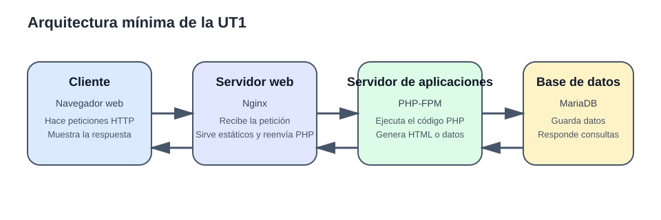
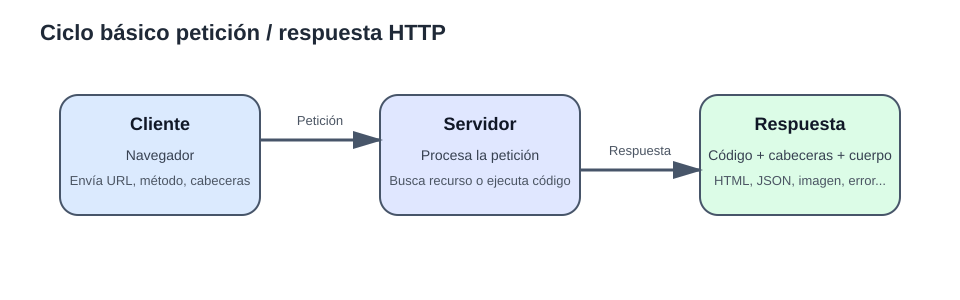
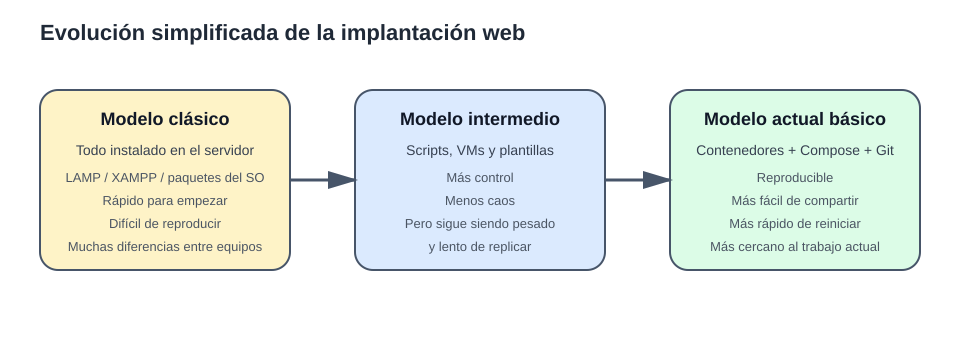

# Apuntes de la UT1

> **Idea central de la unidad**
>
> En esta UT no vamos a memorizar comandos sueltos. Vamos a entender **qué es una aplicación web**, **qué piezas la forman**, **cómo se comunican**, **cómo ha evolucionado su implantación** y **por qué hoy tiene sentido trabajar con entornos reproducibles**.

---

## 1. Qué es una aplicación web

Una **aplicación web** es un software al que se accede normalmente a través de un navegador usando una red y el protocolo HTTP o HTTPS.

Cuando abres una web, en realidad no “entras dentro de un programa” como en una aplicación de escritorio. Lo que haces es:

1. pedir un recurso o una acción a un servidor;
2. el servidor procesa esa petición;
3. devuelve una respuesta;
4. el navegador interpreta esa respuesta y la muestra.

### Metáfora útil

Piensa en una aplicación web como en un **restaurante**:

- el **cliente** es quien hace el pedido;
- el **camarero** recoge el pedido y lo lleva a quien corresponde;
- la **cocina** prepara el plato;
- el **almacén** guarda ingredientes y datos;
- después el camarero devuelve el resultado al cliente.

En la arquitectura web:

- el **navegador** hace el pedido;
- el **servidor web** recibe la petición;
- el **servidor de aplicaciones** ejecuta la lógica;
- la **base de datos** guarda y recupera información.

### Aplicación web no significa solo “página bonita”

Una aplicación web puede ser:

- una web informativa;
- un blog;
- una tienda online;
- una plataforma educativa;
- una intranet;
- una API que no devuelve HTML, sino datos en JSON.

### Mini ejercicio 1

Trabaja con estos tres ejemplos concretos:

- **Aules** para entrar en una asignatura y leer un tema.
- **Gmail web** para consultar la bandeja de entrada.
- **OpenStreetMap** para ver un mapa en el navegador.

Copia esta tabla en tu cuaderno o en un archivo Markdown y complétala:

| Aplicación web | ¿El usuario ve HTML, datos o ambas cosas? | Explicación breve |
|---|---|---|
| Aules |  |  |
| Gmail web |  |  |
| OpenStreetMap |  |  |

Después redacta una respuesta de **dos frases exactas** a esta pregunta: ¿por qué una aplicación web no es lo mismo que un programa de escritorio?

---

## 2. Páginas estáticas y páginas dinámicas

### 2.1. Página estática

Una **página estática** es aquella cuyo contenido se entrega tal y como está almacenado en un archivo.

Ejemplos típicos:

- `index.html`
- una hoja de estilos CSS
- una imagen
- un PDF

El servidor web solo tiene que:

- localizar el archivo;
- enviarlo al cliente.

### 2.2. Página dinámica

Una **página dinámica** se genera o se modifica en el momento de la petición.

Eso puede ocurrir porque:

- ejecuta código del lado servidor;
- consulta una base de datos;
- personaliza el contenido según el usuario;
- responde a formularios o sesiones.

Ejemplo:

- un panel de usuario que muestra su nombre;
- una tienda que filtra productos;
- una noticia que se lee desde una base de datos.

### Ejemplo sencillo

**Estática:**

```html
<h1>Bienvenido a mi web</h1>
```

**Dinámica (conceptualmente):**

```php
<?php
$nombre = "Victoria";
echo "<h1>Bienvenido, $nombre</h1>";
```

En el segundo caso, el HTML final no está escrito completo en un archivo fijo: se **genera**.

### Qué suele confundir al alumnado

Una página puede verse “normal” en el navegador y, sin embargo, haberse generado dinámicamente antes de llegar al cliente.

El navegador solo ve el **resultado final**.

### Mini ejercicio 2

Clasifica estos cinco casos como **estático**, **dinámico** o **mixto** y escribe una justificación de una línea para cada uno:

1. `https://intranet-centro.example/assets/logo-centro.png`
2. `https://ut1.example/index.html`
3. `https://ut1.example/noticias.php?id=8`
4. `https://api.ut1.example/productos`
5. `https://ut1.example/catalogo.html`, donde el HTML inicial carga después los productos con JavaScript desde `/api/productos`

---

## 3. Componentes de una aplicación web

## 3.1. Vista general



En esta unidad vamos a trabajar con una arquitectura mínima pero realista:

- **cliente**: navegador;
- **servidor web**: Nginx;
- **servidor de aplicaciones**: PHP-FPM;
- **base de datos**: MariaDB.

## 3.2. Cliente

El cliente suele ser el navegador.

Su trabajo principal es:

- hacer la petición;
- enviar formularios;
- interpretar HTML, CSS y JavaScript;
- mostrar la respuesta al usuario.

## 3.3. Servidor web

El **servidor web** es la puerta de entrada.

Se encarga de:

- escuchar peticiones HTTP/HTTPS;
- localizar recursos estáticos;
- devolver respuestas;
- reenviar ciertas peticiones al componente que debe procesarlas.

### Opciones habituales

- **Nginx**
- **Apache HTTP Server**
- **Caddy**

### Diferencia rápida entre ellos

- **Apache** ha sido históricamente muy usado y es muy flexible.
- **Nginx** es muy habitual como servidor web y reverse proxy.
- **Caddy** es una opción moderna y muy cómoda para configuraciones sencillas.

### Qué significa aquí “reverse proxy”

El término **reverse proxy** puede sonar más complejo de lo que realmente necesitamos en esta UT.

Puedes entenderlo así:

- el navegador habla primero con **Nginx**;
- Nginx recibe la petición;
- y, si hace falta, Nginx la reenvía al servicio interno que realmente debe procesarla.

En nuestro stack, eso significa que el cliente no habla directamente con **PHP-FPM** ni con **MariaDB**. Habla con **Nginx**, y Nginx decide si responde por sí mismo o si pasa el trabajo a otro servicio.

Dicho de forma simple, un **reverse proxy** es una pieza que se coloca delante de otros servicios y les reparte o reenvía peticiones.

### Por qué nos interesa esta idea en UT1

Porque ayuda a entender una separación muy importante:

- **Nginx** se encarga de recibir HTTP y de servir archivos estáticos;
- **PHP-FPM** se encarga de ejecutar el código PHP;
- **MariaDB** se encarga de guardar datos.

No hace falta profundizar ahora en todos los usos de un reverse proxy. Para esta unidad basta con esta idea práctica: **Nginx es la puerta de entrada y también la pieza que puede reenviar la petición al servicio adecuado**.

En esta UT usaremos **Nginx** porque nos permite visualizar bien su papel como **servidor web** y como **pieza que reenvía las peticiones PHP**.

## 3.4. Servidor de aplicaciones

Aquí es donde vive la lógica del lado servidor.

Su trabajo es:

- ejecutar el código;
- procesar formularios;
- aplicar reglas de negocio;
- consultar la base de datos;
- generar la respuesta.

### Ojo con una confusión muy habitual

En entornos docentes se usa a veces “servidor web” para todo, pero no siempre es correcto.

En nuestro stack:

- **Nginx** no ejecuta PHP por sí mismo;
- **PHP-FPM** sí ejecuta PHP.

### Qué es exactamente PHP-FPM

Aquí conviene separar tres ideas que el alumnado suele mezclar:

- **PHP** es el lenguaje y también el intérprete capaz de ejecutar código PHP;
- **Nginx** es el servidor web que recibe la petición HTTP;
- **PHP-FPM** es el servicio que se queda esperando peticiones para ejecutar archivos PHP de forma eficiente.

Las siglas **FPM** significan **FastCGI Process Manager**.

Dicho de forma simple: PHP-FPM es una forma de tener PHP funcionando como un servicio preparado para atender peticiones que le reenvía el servidor web.

En vez de que Nginx “se invente” cómo ejecutar PHP, Nginx pasa la petición a PHP-FPM y PHP-FPM la procesa.

### Entonces, ¿por qué no decimos solo “PHP”?

Porque decir solo **PHP** no aclara **cómo** se está ejecutando.

Por ejemplo:

- puedes usar PHP en terminal con `php archivo.php`;
- puedes tener PHP integrado de otra manera en un servidor web;
- o puedes usar **PHP-FPM**, que es la opción que vamos a emplear en esta UT.

En nuestro caso no basta con saber que la aplicación está escrita en PHP. También hay que saber **qué componente del stack ejecuta ese código cuando llega una petición web**.

### Qué significa aquí “servicio que ejecuta la aplicación” (runtime)

La palabra **runtime** puede sonar abstracta, pero en esta unidad puedes entenderla como el **servicio que ejecuta la aplicación**.

- es el entorno o servicio que **ejecuta** el código de la aplicación;
- recibe la orden de procesar un archivo o una petición;
- y devuelve el resultado para que el servidor web lo entregue al navegador.

En nuestro stack, cuando hablamos del **servicio que ejecuta la aplicación** o del **runtime PHP**, nos referimos de forma práctica a **PHP-FPM como servicio que ejecuta el código PHP**.

### Flujo real simplificado con PHP-FPM

1. El navegador pide una URL.
2. Nginx recibe la petición.
3. Si es un recurso estático, Nginx responde directamente.
4. Si es un archivo PHP, Nginx reenvía la petición a PHP-FPM.
5. PHP-FPM ejecuta el código PHP.
6. PHP-FPM devuelve la salida a Nginx.
7. Nginx entrega la respuesta al navegador.

### Por qué se usa PHP-FPM en lugar de “solo PHP” en este stack

- porque separa mejor el papel del servidor web y el de la ejecución de la aplicación;
- porque permite que Nginx se centre en servir HTTP, archivos estáticos y proxy;
- porque es una forma muy habitual de trabajar con PHP en despliegues actuales;
- porque encaja muy bien con contenedores separados, donde cada servicio tiene una responsabilidad clara.

Para esta UT, la idea importante no es memorizar FastCGI en profundidad, sino entender esto: **Nginx atiende la parte web y PHP-FPM ejecuta la parte PHP**.

### Opciones habituales según tecnología

- **PHP-FPM** para PHP
- **Node.js** para aplicaciones JavaScript del lado servidor
- **Gunicorn/Uvicorn** para Python
- **Tomcat** para aplicaciones Java

No hace falta que domines todas ahora. Lo importante es entender que el **servidor web** y el **servidor de aplicaciones** pueden ser piezas separadas.

## 3.5. Base de datos

La base de datos se encarga de guardar información persistente.

Ejemplos de lo que almacena:

- usuarios;
- productos;
- pedidos;
- publicaciones;
- registros;
- sesiones, según el diseño.

### Opciones habituales

- **MariaDB / MySQL**
- **PostgreSQL**
- **SQLite**
- **MongoDB**

### Qué debes sacar de aquí

- **MariaDB/MySQL** son muy comunes en entornos PHP y CMS clásicos.
- **PostgreSQL** tiene mucha presencia en aplicaciones modernas y proyectos exigentes.
- **SQLite** viene bien para entornos ligeros o pruebas.
- **MongoDB** representa otro modelo distinto, no relacional.

En esta unidad trabajaremos con **MariaDB**, porque encaja muy bien con PHP y con muchos stacks habituales de implantación web.

### Mini ejercicio 3

Completa la siguiente tabla usando **todas** las herramientas de la lista y sin repetir ninguna:

- Nginx
- Apache HTTP Server
- Caddy
- PHP-FPM
- Node.js
- Tomcat
- MariaDB
- PostgreSQL
- MongoDB

| Herramienta | Tipo de componente | Tarea principal |
|---|---|---|
| Nginx |  |  |
| Apache HTTP Server |  |  |
| Caddy |  |  |
| PHP-FPM |  |  |
| Node.js |  |  |
| Tomcat |  |  |
| MariaDB |  |  |
| PostgreSQL |  |  |
| MongoDB |  |  |

Después responde de forma directa:

1. ¿Qué error conceptual cometería un alumno si intentara guardar usuarios dentro de Nginx como si fuera una base de datos?
2. ¿Qué problema concreto tendría una tienda online si no tuviera persistencia?

---

## 4. Arquitectura y flujo de procesamiento

Ahora ya podemos ver el recorrido completo.

### Escenario 1. Recurso estático

1. El navegador pide `/logo.png`.
2. El servidor web localiza el archivo.
3. Lo devuelve directamente.
4. No hace falta ejecutar PHP ni consultar la base de datos.

### Escenario 2. Recurso dinámico

1. El navegador pide `/index.php` o una ruta asociada a lógica PHP.
2. Nginx recibe la petición.
3. Nginx reenvía el procesamiento al servicio PHP-FPM.
4. PHP ejecuta el código.
5. Si hace falta, PHP consulta la base de datos.
6. PHP genera la salida.
7. Nginx devuelve la respuesta al cliente.

### Esquema mental sencillo

```text
Cliente pide -> Servidor web decide ->
  si es estático: responde
  si es dinámico: delega en el servicio que ejecuta la aplicación (runtime)
                  ese servicio puede consultar la BD
                  genera la respuesta
```

### Importancia de separar responsabilidades

Separar servicios tiene varias ventajas:

- cada pieza hace una cosa concreta;
- es más fácil detectar dónde falla algo;
- se puede reiniciar o reemplazar una pieza sin rehacer todo;
- se parece más a cómo se trabaja hoy en muchos entornos reales.

### Mini ejercicio 4

Trabaja con este stack de la unidad:

- navegador
- Nginx
- PHP-FPM
- MariaDB

Para cada petición, escribe el recorrido exacto paso a paso usando el formato `origen -> destino -> destino...`:

1. El usuario abre `http://localhost:8080/logo.png`
2. El usuario abre `http://localhost:8080/index.php?seccion=inicio`
3. El usuario envía por `POST` el formulario de `http://localhost:8080/crear.php` y la aplicación inserta un registro en la base de datos

---

## 5. Protocolo HTTP: la lengua en la que se entienden cliente y servidor

Si la aplicación web fuera una oficina, HTTP sería el **idioma común** que usan cliente y servidor para entenderse.

## 5.1. Qué es HTTP

HTTP es un protocolo de comunicación que define:

- cómo se hace una petición;
- cómo responde el servidor;
- qué métodos existen;
- qué significado tienen los códigos de estado;
- qué información adicional viaja en las cabeceras.

## 5.2. Estructura básica de una petición

Una petición HTTP suele incluir:

- **método**: qué se quiere hacer;
- **ruta o URL**: qué recurso se pide;
- **cabeceras**: información adicional;
- **cuerpo**: datos, si la petición los envía.

Ejemplo conceptual:

```http
GET /productos HTTP/1.1
Host: localhost:8080
User-Agent: navegador
Accept: text/html
```

## 5.3. Estructura básica de una respuesta

Una respuesta HTTP suele incluir:

- **código de estado**;
- **cabeceras**;
- **cuerpo**.

Ejemplo conceptual:

```http
HTTP/1.1 200 OK
Content-Type: text/html; charset=UTF-8

<h1>Listado de productos</h1>
```

## 5.4. Ciclo petición / respuesta



## 5.5. Métodos HTTP más habituales

| Método | Uso habitual | Ejemplo típico |
|---|---|---|
| `GET` | pedir información | ver una página o un listado |
| `POST` | enviar datos para crear o procesar | enviar un formulario |
| `PUT` | reemplazar un recurso | actualizar un recurso completo |
| `PATCH` | modificar parcialmente | cambiar solo un campo |
| `DELETE` | eliminar | borrar un recurso |

En esta UT vas a ver sobre todo `GET` y `POST`.

## 5.6. Códigos de estado más habituales

### 2xx: todo ha ido bien
- `200 OK`
- `201 Created`

### 3xx: redirecciones
- `301 Moved Permanently`
- `302 Found`

### 4xx: error del cliente o recurso no disponible
- `400 Bad Request`
- `401 Unauthorized`
- `403 Forbidden`
- `404 Not Found`

### 5xx: error del servidor
- `500 Internal Server Error`
- `502 Bad Gateway`
- `503 Service Unavailable`

## 5.7. Cómo ver una petición y una respuesta de verdad

Tienes varias opciones sencillas:

### Opción A. Herramientas del navegador
1. Abre una web.
2. Pulsa `F12` o abre las herramientas de desarrollador.
3. Ve a la pestaña **Network / Red**.
4. Recarga la página.
5. Observa método, código de estado, cabeceras y tipo de recurso.

### Opción B. `curl`
Desde terminal puedes hacer pruebas muy simples:

```bash
curl -I http://localhost:8080
curl http://localhost:8080
```

### Opción C. Cliente HTTP visual
Si prefieres algo gráfico, puedes usar un cliente HTTP visual y comparar lo que ves con `curl` y con las herramientas del navegador.

### Mini ejercicio 5

Analiza esta petición y esta respuesta HTTP:

```http
GET /productos HTTP/1.1
Host: localhost:8080
User-Agent: curl/8.7.1
Accept: */*
```

```http
HTTP/1.1 200 OK
Server: nginx/1.27.0
Content-Type: application/json
Content-Length: 55

[{"id":1,"nombre":"Teclado"},{"id":2,"nombre":"Ratón"}]
```

Responde:

1. ¿Cuál es el método HTTP?
2. ¿Qué ruta se está pidiendo?
3. ¿Cuál es el código de estado?
4. Escribe una cabecera de petición y una cabecera de respuesta.
5. ¿El servidor está devolviendo HTML o datos? Indica el tipo exacto.


Investiga las cabeceras más habituales de petición y de respuesta e indica para qué se utilizan.

---

## 6. Del modelo clásico LAMP al entorno reproducible

La implantación de aplicaciones web no siempre se ha hecho igual.



## 6.1. Modelo clásico: instalar todo en el sistema

Durante muchos años fue muy normal trabajar con un modelo como este:

- Linux
- Apache
- MySQL / MariaDB
- PHP

Todo se instalaba directamente en el sistema operativo.

### Ventajas del modelo clásico

- ayuda a entender de dónde sale cada pieza;
- es muy directo conceptualmente;
- históricamente ha sido muy utilizado.

### Desventajas del modelo clásico

- cada equipo puede quedar distinto;
- aparecen conflictos de versiones;
- cuesta replicar el entorno;
- reinstalar o limpiar puede ser pesado;
- el “en mi ordenador funciona” aparece con mucha facilidad.

## 6.2. Hacia la reproducibilidad

Con el tiempo empezó a ser más importante:

- definir el entorno como código o configuración;
- levantarlo rápido;
- compartirlo con otras personas;
- poder destruirlo y reconstruirlo;
- reducir diferencias entre equipos.

Ahí entran en juego herramientas como:

- **Git** para versionar;
- **Docker** para empaquetar y ejecutar servicios;
- **Docker Compose** para describir varios servicios juntos.

## 6.3. Qué significa que un entorno sea reproducible

Que otra persona, siguiendo unos pasos razonables, pueda obtener **el mismo entorno o uno muy parecido** sin tener que reconstruirlo a mano desde cero.

### Ejemplo mental

- **Modelo clásico**: “instala Apache, luego PHP, luego la BD, toca estos 7 ficheros y reza para que todo coincida”.
- **Modelo reproducible**: “clona el repo, revisa el `.env`, ejecuta `docker compose up -d` y comprueba”.

No es magia. Sigue habiendo configuración. Pero está mucho más **estructurada**, **documentada** y **portable**.

### Mini ejercicio 6

Completa esta tabla escribiendo en cada fila solo una de estas dos opciones:

- **LAMP clásico**
- **Entorno reproducible con Git + Docker Compose**

| Situación | Opción correcta |
|---|---|
| Cada alumno instala manualmente Apache, PHP y MariaDB en su sistema operativo. |  |
| Todo el grupo usa el mismo `compose.yaml` y los mismos nombres de servicio. |  |
| Cambiar de ordenador obliga a repetir la instalación paso a paso. |  |
| El proyecto se puede clonar y levantar con `docker compose up -d`. |  |
| Dos alumnos pueden tener versiones distintas de PHP sin darse cuenta. |  |
| La configuración principal del entorno queda descrita en ficheros del proyecto. |  |

Después escribe una conclusión de **una sola frase**: cuál de los dos modelos encaja mejor con esta UT y por qué.

---

## 7. Herramientas actuales de la implantación web en esta UT

## 7.1. Git: control de versiones y orden de trabajo

Git no se usa en esta unidad para hacer ramas complejas ni trabajo colaborativo avanzado. Se usa porque es una herramienta profesional básica.

### Para qué nos sirve aquí

- guardar el proyecto;
- registrar cambios;
- compartir la práctica;
- evitar trabajar con carpetas desordenadas;
- mantener un `README.md` y una estructura limpia.

### Qué debes saber hacer en esta UT

```bash
git clone URL_DEL_REPOSITORIO
git status
git add .
git commit -m "Mensaje claro"
git push
```

### Mini ejercicio 7

Vamos a comprobar los commit que has ido haciendo en la rama de los ejercicios de esta unidad. Para ello, vas a aprender un nuevo comando: `git log`. Este comando, muestra la lista de todos los cambios (commits) guardados en tu proyecto, ordenados desde el más reciente hasta el más antiguo.

1. Sitúate en la rama de los ejercicios de la UT1 `git checkout ut1-ejercicios`.
2. Ejecuta `git log`.
3. Copia el resultado.
4. Anota cuántos commits llevas hechos.

## 7.2. Docker: encapsular servicios

Docker permite ejecutar aplicaciones y servicios en contenedores.

### Idea simple

Un contenedor no es “una máquina virtual pequeña”, aunque a veces el alumno lo imagine así. Para esta unidad es mejor entenderlo como:

- una forma de ejecutar un servicio con su configuración y su entorno;
- una pieza aislada del resto;
- algo que se puede levantar, parar y reemplazar con facilidad.

### Conceptos mínimos

- **imagen**: plantilla base;
- **contenedor**: instancia ejecutándose;
- **puerto**: forma de publicar acceso al exterior;
- **volumen**: forma de persistir o compartir archivos;
- **logs**: salida del servicio para ver qué ocurre.

### Por qué usar contenedores

Al desarrollar una aplicación web intervienen varias piezas: un servidor web, un lenguaje o runtime, extensiones y, con frecuencia, una base de datos. Instalarlas directamente en cada equipo puede dar resultados distintos: una versión puede no coincidir, puede faltar una extensión o una configuración anterior puede interferir.

Un contenedor permite describir y ejecutar cada pieza con unas versiones y una configuración conocidas. Así, dos personas pueden levantar el mismo entorno a partir de las mismas instrucciones.

En esta UT los contenedores nos sirven para:

- crear un entorno web sin instalar Nginx, PHP o MariaDB directamente en el sistema;
- separar las responsabilidades de cada servicio;
- repetir el entorno en otro equipo con menos cambios manuales;
- eliminar y volver a crear servicios cuando sea necesario.

Docker no sustituye a Git: Git guarda la configuración y el código del proyecto; Docker usa esa configuración para ejecutar los servicios.

### Imagen, contenedor y servicio: una comparación

Vamos a trabajar con el siguiente ejemplo de ejecución de un contenedor:

```bash
docker run --name ut1-nginx-prueba -d -p 8081:80 nginx:stable
```

Puedes pensar en una imagen como una receta: indica qué software y configuración base se van a usar. Un contenedor es el resultado de poner esa receta en marcha. Por ejemplo, `nginx:stable` es una imagen y `ut1-nginx-prueba` puede ser un contenedor creado a partir de ella.

Un **servicio** es el papel que cumple un contenedor dentro de una aplicación. En nuestro futuro archivo `compose.yaml`, que veremos más adelante, el servicio `nginx` atenderá las peticiones web, aunque el contenedor concreto que lo ejecute pueda crearse, eliminarse y volver a crearse.

### Ciclo de vida básico

Un contenedor se crea a partir de una imagen y puede estar detenido o en ejecución:

```text
imagen -> docker run -> contenedor en ejecución -> docker stop -> contenedor detenido
                                                   |
                                                   -> docker rm -> eliminado
```

Al eliminar un contenedor no se elimina su imagen. Por eso puedes crear otro contenedor igual a partir de la misma imagen.

### Puertos: conectar el navegador con el contenedor

Los servicios dentro de un contenedor usan sus propios puertos. Para poder abrirlos desde tu equipo, Docker debe publicar un puerto con el formato `PUERTO_DEL_EQUIPO:PUERTO_DEL_CONTENEDOR`.

```bash
-p 8081:80
```

En este ejemplo, Nginx escucha en el puerto `80` dentro del contenedor y el navegador accede desde el equipo mediante `http://localhost:8081`. `localhost` significa tu propio equipo. El puerto de la izquierda es el que eliges en tu equipo; el de la derecha depende del servicio que ejecutas.

### Volúmenes: qué ocurre con los archivos

Un contenedor se debe poder reemplazar. Por eso no conviene guardar dentro de él el código que editas o datos que quieras conservar. Un volumen enlaza una carpeta o almacena datos fuera del ciclo de vida del contenedor.

```bash
-v ./app:/usr/share/nginx/html:ro
```

Aquí la carpeta local `app` se muestra dentro del contenedor como `/usr/share/nginx/html`. El sufijo `:ro` significa *solo lectura*: Nginx puede leer los archivos, pero no modificarlos. Más adelante usarás esta idea para compartir la carpeta de la aplicación entre los servicios web y PHP.

### Cómo comprobar qué está ocurriendo

Cuando un servicio no responde, evita adivinar. Comprueba primero si está en ejecución y después consulta su salida:

```bash
docker ps
docker ps -a
docker logs NOMBRE_CONTENEDOR
```

`docker ps` muestra solo los contenedores que están en marcha. `docker ps -a` también muestra los detenidos; es útil para saber si un contenedor se ha parado nada más iniciarse. Los logs suelen explicar la causa del problema.


### Mini ejercicio 8

Si Docker está disponible en tu equipo, ejecuta exactamente estos comandos:

```bash
docker run --name ut1-nginx-prueba -d -p 8081:80 nginx:stable
docker ps
docker stop ut1-nginx-prueba
docker rm ut1-nginx-prueba
```

Después responde:

1. ¿Qué imagen se ha usado?
2. ¿Qué nombre tiene el contenedor?
3. ¿Qué puerto del equipo se ha publicado?
4. Escribe una frase que explique la diferencia entre **imagen** y **contenedor** usando este ejemplo.

### Mini ejercicio 9

Sin ejecutar comandos, responde a partir de esta orden:

```bash
docker run --name web-prueba -d -p 8090:80 nginx:stable
```

1. Indica la imagen, el nombre del contenedor y el puerto que abrirías en el navegador.
2. Explica qué significa cada lado de `8090:80`.
3. Si otro programa ya usa el puerto `8090` en tu equipo, ¿podrá iniciarse ese contenedor con esa orden? ¿Qué cambio sencillo harías?
4. Escribe el comando para consultar los logs del contenedor `web-prueba`.

### Mini ejercicio 10

Si Docker está disponible en tu equipo, ejecuta estos comandos:

```bash
mkdir ut1-volumen-prueba
cd ut1-volumen-prueba
printf '<h1>Docker y volumen</h1>\n' > index.html
docker run --name ut1-nginx-volumen -d -p 8082:80 -v "$PWD":/usr/share/nginx/html:ro nginx:stable
```

Abre `http://localhost:8082` y, cuando termines, elimina el contenedor:

```bash
docker stop ut1-nginx-volumen
docker rm ut1-nginx-volumen
```

Ahora, modifica el contenido de `index.html` y vuelve a crear un contenedor nuevo con la instrucción anterior de creación.

Vuelve a abrir `http://localhost:8082`  y observa qué ha ocurrido.
Recuerda parar y eliminar el contenedor.

Responde:

1. ¿De qué carpeta local obtiene Nginx el archivo `index.html`?
2. ¿En qué ruta del contenedor aparece esa carpeta?
3. ¿Qué evita el sufijo `:ro`?
4. Explica por qué, al cambiar `index.html` en tu equipo, no hace falta crear una nueva imagen para ver el cambio.


Para profundizar más en el uso de Docker, os recomiendo realizar el siguiente curso: [Curso Docker](https://github.com/victoria-nr/curso_docker_ies/)


## 7.3. Variables de entorno y archivos `.env`

### Qué es una variable de entorno

Una **variable de entorno** es un dato de configuración que un programa recibe desde fuera de su código.

En una aplicación web, estas variables suelen servir para indicar cosas como:

- el host de la base de datos;
- el nombre de la base de datos;
- el usuario;
- la contraseña;
- el modo de trabajo, por ejemplo desarrollo o producción.

Por eso en la práctica 2 verás nombres como `DB_HOST`, `DB_NAME`, `DB_USER` o `DB_PASSWORD`.

### Por qué se usan

Si esos datos se escriben directamente dentro del código PHP, cambiar de entorno se vuelve más incómodo y más propenso a errores.

Con variables de entorno, el código puede mantenerse más limpio y la configuración puede cambiarse sin reescribir la aplicación.

Ejemplo mental:

- mala idea: escribir la contraseña de la base de datos directamente dentro de `index.php`;
- mejor idea: que `index.php` lea ese valor desde una variable de entorno.

### Cómo suelen aparecer en `.env`

En muchos proyectos estas variables se guardan en un archivo llamado `.env`.

Su sintaxis básica suele ser así:

```env
DB_HOST=db
DB_NAME=ut1db
DB_USER=ut1user
DB_PASSWORD=ut1pass
DB_ROOT_PASSWORD=rootpass
```

Cada línea define una variable con el formato `NOMBRE=valor`.

### Diferencia entre `.env` y `.env.example`

- **`.env.example`**: plantilla de referencia con las variables que necesita el proyecto;
- **`.env`**: archivo real que se usa al trabajar en local.

La idea habitual es:

1. el proyecto incluye `.env.example` para documentar qué variables hacen falta;
2. cada persona crea su propio `.env` a partir de esa plantilla;
3. el archivo `.env` real no debería subirse al repositorio si contiene datos sensibles o específicos del equipo.

### Qué debes entender en esta UT

- una variable de entorno es una forma de pasar configuración sin incrustarla en el código;
- `.env.example` documenta qué variables necesita el proyecto;
- `.env` contiene los valores reales de trabajo.

## 7.4. Docker Compose: varios servicios definidos juntos

Docker Compose permite describir una aplicación formada por varios servicios en un solo archivo YAML.

### Qué resuelve en esta UT

En vez de arrancar a mano cada pieza por separado, definimos:

- servidor web;
- servicio que ejecuta PHP (runtime);
- base de datos;
- volúmenes;
- variables de entorno;
- puertos.

Todo eso queda centralizado.

### Cómo encaja esto con Docker Compose

En Docker Compose verás dos ideas relacionadas, que no conviene mezclar:

- el bloque `environment`, que sirve para pasar variables a un servicio;
- el archivo `.env`, que suele ayudar a guardar o reutilizar esos valores de configuración.

Por ejemplo, un servicio PHP puede recibir variables como estas:

```yaml
services:
  php:
    environment:
      DB_HOST: db
      DB_NAME: ut1db
      DB_USER: ut1user
      DB_PASSWORD: ut1pass
```

Eso significa que el contenedor de PHP tendrá disponibles esas variables y la aplicación podrá leerlas.

No hace falta que memorices todos los detalles de implementación: lo importante aquí es entender que Docker Compose puede pasar esas variables a los servicios del stack.

### Elementos básicos que debes reconocer

```yaml
services:
  nginx:
    image: nginx:stable
  php:
    image: php:8.3-fpm
  db:
    image: mariadb:11
```

Además vas a ver:

- `ports`
- `volumes`
- `environment`
- `depends_on`

### Comandos básicos

```bash
docker compose up -d
docker compose ps
docker compose logs
docker compose down
```

### Idea crítica: el nombre del servicio importa

Dentro del stack, un servicio se comunica con otro usando normalmente el **nombre del servicio**.

Por eso, si el servicio de base de datos se llama `db`, PHP debe conectarse a `db`, no a `localhost`.

### Mini ejercicio 11

Trabaja con este `compose.yaml`:

```yaml
services:
  nginx:
    image: nginx:stable
    ports:
      - "8080:80"
    volumes:
      - ./app:/var/www/html
      - ./nginx/default.conf:/etc/nginx/conf.d/default.conf:ro
    depends_on:
      - php

  php:
    image: php:8.3-fpm
    volumes:
      - ./app:/var/www/html

  db:
    image: mariadb:11
    environment:
      MYSQL_DATABASE: ut1app
      MYSQL_USER: ut1user
      MYSQL_PASSWORD: ut1pass
      MYSQL_ROOT_PASSWORD: rootpass
```

Responde a partir de ese fichero exacto:

1. ¿Cuántos servicios hay?
2. ¿Qué imagen usa cada uno?
3. ¿Qué puertos están publicados?
4. ¿Qué pasaría si cambias el nombre del servicio `db` pero no cambias la conexión en PHP?
5. Escribe los tres comandos exactos para levantar el stack, desmontarlo y volver a levantarlo.

En este apartado no se pide solo detener temporalmente los contenedores, sino comprobar que el entorno puede desmontarse y recrearse de forma reproducible.

---

## 8. Stacks o combinaciones habituales

No existe un único stack válido. Lo importante es entender el papel de cada pieza.

### Algunos ejemplos

| Servidor web | Servidor de aplicaciones / servicio de ejecución (runtime) | Base de datos | Caso típico |
|---|---|---|---|
| Apache | PHP embebido o PHP-FPM | MariaDB/MySQL | entornos clásicos PHP |
| Nginx | PHP-FPM | MariaDB/MySQL | PHP moderno y CMS |
| Nginx | Node.js | PostgreSQL/MongoDB | apps JavaScript del lado servidor |
| Nginx | Gunicorn/Uvicorn | PostgreSQL | apps Python |
| Caddy | PHP-FPM o reverse proxy | MariaDB/PostgreSQL | entornos sencillos y cómodos |

### Qué nos interesa aquí

Vamos a centrarnos en:

- **Nginx**
- **PHP-FPM**
- **MariaDB**

porque es un stack muy didáctico para ver separación de responsabilidades y encaja muy bien con el módulo.

### Mini ejercicio 12

Compara estos dos casos cerrados:

### Caso A. WordPress autogestionado
- servidor web: Nginx
- servicio que ejecuta la aplicación (runtime): PHP-FPM
- base de datos: MariaDB

### Caso B. Nextcloud autogestionado
- servidor web: Apache
- servicio que ejecuta la aplicación (runtime): PHP
- base de datos: MariaDB

Responde:

1. ¿Qué servidor web usan?
2. ¿Qué servicio de ejecución de la aplicación (runtime) o servidor de aplicaciones usan?
3. ¿Qué base de datos usan?
4. ¿En qué se parecen y en qué se diferencian del stack de esta UT?

---

## 9. Nuestro stack de trabajo: Nginx + PHP-FPM + MariaDB

## 9.1. Qué hace cada pieza

### Nginx
- recibe la petición;
- sirve recursos estáticos;
- reenvía la ejecución PHP al servicio adecuado.

### PHP-FPM
- ejecuta el código PHP;
- procesa formularios;
- consulta la base de datos si hace falta;
- genera la salida.

En otras palabras: PHP-FPM es el servicio del stack que hace de “motor de ejecución” para la aplicación PHP. No es una base de datos, no es el servidor web y no es un lenguaje distinto. Es la pieza que recibe desde Nginx las peticiones que requieren PHP y las ejecuta.

### MariaDB
- guarda información persistente;
- responde consultas;
- permite a la aplicación almacenar y recuperar datos.

## 9.2. Flujo típico

```text
Navegador -> Nginx -> PHP-FPM -> MariaDB
                        |
                        -> genera respuesta -> Nginx -> Navegador
```

## 9.3. Estructura básica del proyecto

```text
ut1-entorno-web/
├── compose.yaml
├── .env.example
├── README.md
├── app/
│   └── index.php
├── nginx/
│   └── default.conf
└── sql/
    └── init.sql
```

## 9.4. Qué debes saber localizar

- dónde se define cada servicio;
- dónde se configuran puertos;
- dónde se definen variables de entorno;
- dónde está la configuración de Nginx;
- dónde está la aplicación PHP;
- dónde está la inicialización de la base de datos.

### Mini ejercicio 13

Trabaja con esta estructura exacta:

```text
ut1-entorno-web/
├── compose.yaml
├── .env.example
├── README.md
├── app/
│   └── index.php
├── nginx/
│   └── default.conf
└── sql/
  └── init.sql
```

Indica la ruta exacta del archivo que tocarías en cada caso:

1. Señala qué archivo tocarías para cambiar el puerto web.
2. Señala qué archivo tocarías para modificar el comportamiento de Nginx.
3. Señala qué archivo tocarías para cambiar una variable de conexión.
4. Señala qué archivo tocarías para editar la aplicación.
5. Escribe una frase concreta que explique por qué conviene no mezclar todo en un único directorio sin orden.

---

## 10. Logs: ver qué está pasando de verdad

Uno de los errores más habituales al empezar es trabajar “a ciegas”.

Si algo falla, los logs ayudan a responder preguntas como:

- ¿el servicio ha arrancado?
- ¿ha dado error?
- ¿qué archivo o configuración está fallando?
- ¿el problema está en Nginx, en PHP o en la base de datos?

### Qué logs nos interesan aquí

- logs de **Nginx**;
- logs de **PHP**;
- logs de **MariaDB**.

### Comandos útiles

```bash
docker compose logs
docker compose logs nginx
docker compose logs php
docker compose logs db
```

### Cómo pensar con logs

- Si la web no responde, revisa primero **Nginx**.
- Si el archivo PHP no se procesa, revisa **Nginx** y **PHP**.
- Si la conexión a datos falla, revisa **PHP** y **db**.

### Mini ejercicio 14

Relaciona cada incidencia con el primer log que revisarías. Usa solo una vez cada opción cuando proceda y añade una justificación de una línea:

Opciones de logs:

- `docker compose logs nginx`
- `docker compose logs php`
- `docker compose logs db`
- `docker compose logs`

Incidencias:

1. El navegador devuelve `404 Not Found` al abrir `http://localhost:8080/logo.png`.
2. Al abrir `http://localhost:8080/index.php` aparece un error PHP en pantalla.
3. La aplicación muestra el mensaje `SQLSTATE[HY000] [2002] Connection refused`.
4. Tras ejecutar `docker compose up -d`, el servicio `db` se detiene nada más arrancar.

---

## 11. Seguridad mínima en esta UT

En esta unidad no vamos a hacer hardening avanzado, pero sí vamos a trabajar con unas bases mínimas razonables.

## 11.1. Qué sí debes cuidar

- no subir contraseñas reales al repositorio;
- usar `.env` o `.env.example` para separar configuración;
- entender qué puertos estás exponiendo;
- no publicar más servicios de los necesarios;
- documentar cómo está montado el entorno;
- diferenciar bien el papel de cada servicio.

## 11.2. Qué significa seguridad mínima aquí

No buscamos un entorno “de producción real”, sino uno de **aprendizaje ordenado y con buenas costumbres**.

### Ejemplos

**Buena práctica:**
- variables de entorno en `.env.example`;
- puertos claros y documentados;
- proyecto ordenado.

**Mala práctica:**
- credenciales escritas en varios archivos sin control;
- puertos abiertos sin saber para qué sirven;
- usar `root` en todo “porque funciona”.

### Mini ejercicio 15

Trabaja con estos fragmentos de una plantilla de proyecto:

```env
APP_ENV=dev
DB_HOST=db
DB_NAME=ut1app
DB_USER=ut1user
DB_PASSWORD=ut1pass
DB_ROOT_PASSWORD=rootpass
```

```yaml
services:
  nginx:
    ports:
      - "8080:80"
  db:
    ports:
      - "3307:3306"
```

Responde de forma concreta:

1. ¿Qué datos no subirías a un repositorio público?
2. ¿Qué puertos se están publicando?
3. ¿Hace falta publicar todos esos puertos al exterior?
4. ¿Qué ventaja concreta tiene documentar bien la estructura y la configuración de este proyecto?

---

## 12. Resumen final de la unidad

Al terminar esta parte teórica deberías tener claro que:

1. una aplicación web está formada por varias piezas con funciones distintas;
2. HTTP es el idioma de comunicación entre cliente y servidor;
3. estático y dinámico no significan lo mismo;
4. el modelo clásico LAMP ayuda a entender el origen, pero hoy interesa mucho trabajar con entornos reproducibles;
5. Git, Docker y Docker Compose no son “modas”: son herramientas que dan orden, repetibilidad y contexto profesional;
6. en esta UT trabajaremos con el stack **Nginx + PHP-FPM + MariaDB**;
7. los logs y una seguridad mínima son parte del trabajo desde el principio.

---

## 13. Mapa mental de repaso

```text
Aplicación web
├── Cliente
│   └── navegador
├── Comunicación
│   └── HTTP / HTTPS
├── Componentes
│   ├── servidor web
│   ├── servidor de aplicaciones
│   └── base de datos
├── Tipos de respuesta
│   ├── estática
│   └── dinámica
├── Evolución de la implantación
│   ├── modelo clásico LAMP
│   └── entornos reproducibles
└── Herramientas de esta UT
    ├── Git
    ├── Docker
    ├── Docker Compose
    ├── Nginx
    ├── PHP-FPM
    └── MariaDB
```

---

## 14. Autoevaluación rápida

Intenta responder sin mirar los apuntes:

1. ¿Qué diferencia hay entre una página estática y una dinámica?
2. ¿Qué papel tiene Nginx en nuestro stack?
3. ¿Qué papel tiene PHP-FPM?
4. ¿Qué hace la base de datos?
5. ¿Qué partes tiene una petición HTTP?
6. ¿Qué significa un `404`? ¿Y un `500`?
7. ¿Por qué un entorno reproducible es mejor para esta unidad que un montaje clásico manual?
8. ¿Para qué sirve Git aquí?
9. ¿Para qué sirve Docker aquí?
10. ¿Para qué sirve Docker Compose aquí?
11. ¿Por qué PHP suele conectarse a `db` y no a `localhost` dentro del stack?
12. ¿Qué logs mirarías si la aplicación no conecta con la base de datos?
