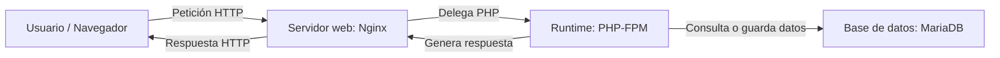

# UT1. Entorno reproducible de implantación web

## Presentación de la unidad

Esta unidad construye la base técnica de todo el módulo. Antes de programar con PHP, conectar con bases de datos o trabajar con CMS, el alumnado necesita entender **qué es realmente una aplicación web**, **qué componentes la forman** y **cómo se despliega hoy en día de forma ordenada y reproducible**.

La idea principal no es aprender comandos aislados de Docker o Git, sino entender que una aplicación web moderna suele estar formada por varios servicios coordinados y que conviene poder levantar ese entorno de forma repetible, documentada y portable.

A lo largo de la unidad trabajaremos desde dos planos a la vez:

- el **plano conceptual**, para entender arquitectura, HTTP, componentes y evolución histórica;
- el **plano operativo**, para montar un entorno mínimo basado en `Nginx + PHP-FPM + MariaDB` usando `Docker Compose` y documentarlo correctamente.

---

## Pregunta guía de la unidad

> **¿Qué piezas necesita una aplicación web para funcionar y cómo podemos montarlas hoy de forma reproducible, ordenada y profesional?**

Si se entiende bien esta pregunta, se entiende la base del resto del módulo.

---

## Resultado de aprendizaje trabajado

### RA1. Prepara el entorno de desarrollo y los servidores de aplicaciones web instalando e integrando las funcionalidades necesarias.

### Criterios de evaluación del RA

1. Se ha identificado el software necesario para su funcionamiento.  
2. Se han identificado las diferentes tecnologías empleadas.  
3. Se han instalado y configurado servidores web y de bases de datos.  
4. Se han reconocido las posibilidades de procesamiento en los entornos cliente y servidor.  
5. Se han añadido y configurado los componentes y módulos necesarios para el procesamiento de código en el servidor.  
6. Se ha instalado y configurado el acceso a bases de datos.  
7. Se ha establecido y verificado la seguridad en los accesos al servidor.  
8. Se han utilizado plataformas integradas orientadas a la prueba y desarrollo de aplicaciones web.  
9. Se han documentado los procedimientos realizados.

---

## Qué vas a aprender

Al terminar esta unidad deberías ser capaz de:

- explicar qué es una aplicación web y diferenciar sus componentes principales;
- distinguir páginas estáticas y dinámicas, cliente y servidor, servidor web y servidor de aplicaciones;
- entender el ciclo básico de una petición y respuesta HTTP;
- explicar qué papel tienen Git, Docker y Docker Compose en un entorno actual de implantación web;
- comparar el modelo clásico LAMP con un entorno reproducible moderno;
- levantar un stack mínimo con `Nginx + PHP-FPM + MariaDB`;
- revisar logs básicos y detectar incidencias iniciales;
- aplicar medidas mínimas de seguridad y documentación técnica.

---

## Relación con el módulo

### Ahora, en la UT1
Se construye el entorno y el marco conceptual de implantación.

### Después, en la UT2
Ese entorno servirá para programar en PHP y entender cómo se ejecuta el código en servidor.

### Después, en la UT3
Se ampliará el stack conectando PHP con base de datos de forma aplicada.

### Más adelante
El mismo entorno conceptual servirá para CMS, administración, modificación y despliegue de aplicaciones web.

---

## Duración y organización

- **20 horas en centro**
- **10 sesiones de 2 horas**

Secuencia orientativa de trabajo:

1. Presentación general del módulo y de la UT1: dinámica de trabajo, tipo de actividades, forma de entrega, criterios de seguimiento y organización de las clases. En esta sesión no se empiezan todavía los contenidos propios de la unidad.  
2. Qué es una aplicación web, diferencia entre estático y dinámico y componentes de una aplicación web: cliente, servidor web, runtime o servidor de aplicaciones y base de datos. 
3. Visión general de la arquitectura web y HTTP: petición, respuesta, métodos y códigos de estado más habituales.  
4. Evolución de la implantación web: del modelo LAMP clásico al entorno reproducible. Git en contexto profesional: repositorio, cambios, commits y papel de Git dentro de la UT.
5. Docker: imágenes, contenedores, puertos, volúmenes y lectura básica de logs.
6. Docker Compose: servicios, variables de entorno, relaciones entre contenedores y arranque del stack.  
7.  Stack de trabajo de la UT: `Nginx + PHP-FPM + MariaDB`, recorrido de una petición y verificación inicial del entorno. 
8.  Práctica 1.
9.  Logs y seguridad mínima
10. Práctica 2 guiada de despliegue reproducible, revisión de incidencias frecuentes y seguridad mínima.  
11. Cierre de la UT: validación, cuestionario y repaso final de los conceptos clave.

---

## Contenidos de la unidad

1. Qué es una aplicación web.  
2. Páginas estáticas y páginas dinámicas.  
3. Arquitectura básica y componentes.  
4. Protocolo HTTP.  
5. Evolución de la implantación web.  
6. Git en contexto de implantación.  
7. Docker y contenedores.  
8. Docker Compose y aplicaciones multicontenedor.  
9. Stacks habituales y foco en `Nginx + PHP-FPM + MariaDB`.  
10. Logs, verificación y seguridad básica.

---

## Idea clave: una aplicación web actual no es una sola pieza

### Conclusión importante

- El **navegador** hace peticiones y muestra respuestas.
- El **servidor web** recibe la petición y sirve recursos o la redirige a quien toca.
- El **runtime o servidor de aplicaciones** ejecuta la lógica.
- La **base de datos** persiste información.
- Para que todo esto funcione bien, hoy interesa que el entorno sea **reproducible** y **documentado**.

---

## Herramientas que usaremos

- **Git**
- **Docker**
- **Docker Compose**
- **Nginx**
- **PHP-FPM**
- **MariaDB**
- **VS Code**
- **logs del entorno**
- **README técnico**

---

## Qué no vamos a hacer todavía

En esta unidad **todavía no** vamos a:

- desarrollar lógica de negocio compleja en PHP;
- conectar formularios reales con base de datos desde código;
- desplegar en cloud pública;
- trabajar con CI/CD o GitHub Actions;
- administrar CMS;
- aplicar hardening avanzado.

La prioridad es consolidar el marco técnico de implantación.

---

## Qué serás capaz de montar al final

Al terminar la unidad podrás preparar un proyecto con:

- repositorio básico en Git;
- estructura de carpetas clara;
- stack definido en `compose.yaml`;
- servidor web `nginx`;
- runtime `php`;
- base de datos `db`;
- variables de entorno mínimas;
- documentación operativa básica;
- verificación funcional inicial.

---

## Productos de trabajo de la unidad

### Práctica 1
Preparación del entorno, repositorio y estructura base del proyecto.

### Práctica 2
Despliegue reproducible de un entorno web multicontenedor con `Docker Compose`.

---

## Errores típicos que vamos a combatir

- pensar que una aplicación web es solo “la página que se ve”; 
- confundir servidor web con servidor de aplicaciones;
- no distinguir bien qué ocurre en el cliente y qué ocurre en el servidor;
- creer que Docker Compose es solo una lista de comandos;
- usar `localhost` donde debería usarse el nombre del servicio;
- trabajar sin logs ni documentación;
- exponer puertos o credenciales sin entender para qué.

---

## Cómo se evaluará

La evaluación combinará:

- ejercicios;
- prácticas guiadas;
- cuestionarios;
- exámenes;

Se valorará especialmente que el alumnado:

- **entienda** la arquitectura que monta;
- **explique** el papel de cada servicio;
- **documente** lo que ha hecho;
- **detecte** errores básicos y sepa dónde mirar;
- **transfiera** lo aprendido a pequeñas variantes.

---
