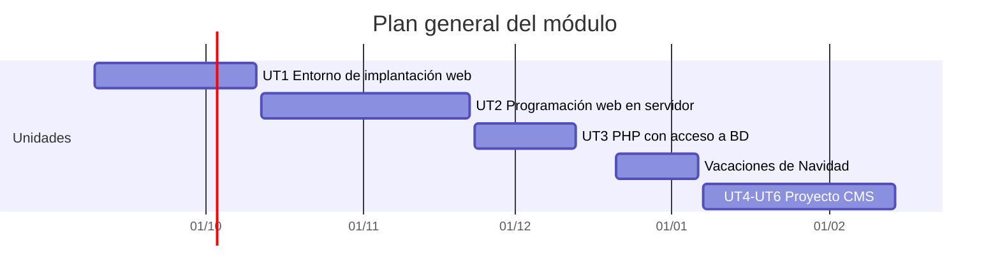
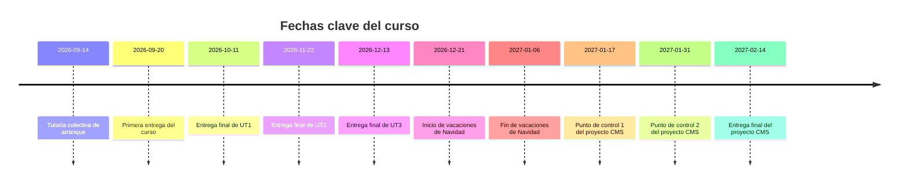

# Planificación del módulo y calendario de trabajo

Este documento resume el ritmo de trabajo del módulo para que tengas claro:

- cuántas semanas dedicaremos a cada unidad;
- qué tutorías colectivas hay previstas en semipresencial;
- qué debes entregar cada domingo;
- cómo se organiza el proyecto de CMS de UT4, UT5 y UT6.

## 1. Vista general del curso



## 2. Reglas de trabajo durante el curso

- La fecha ordinaria de entrega será siempre el domingo por la noche.
- No habrá entregas entre el 21 de diciembre y el 6 de enero.
- Las entregas se harán en tu repositorio privado del módulo.
- Los ejercicios de teoría se entregan actualizando `unidades/UTX/ejercicios.md`.
- Los puntos de control de prácticas se entregan actualizando la carpeta de la práctica correspondiente.
- Para cada bloque de trabajo se recomienda usar una rama propia y mantener una Pull Request abierta hasta cerrar ese bloque.
- Si una práctica continúa varias semanas, debes reutilizar la misma rama y la misma Pull Request; no abras una rama nueva cada domingo.

## 3. Cómo entregar cada tipo de bloque

### Ejercicios de teoría

Cuando la entrega sea de ejercicios, actualiza:

- `unidades/UT1/ejercicios.md`
- `unidades/UT2/ejercicios.md`
- `unidades/UT3/ejercicios.md`

Rama orientativa:

```text
ut1-ejercicios
ut2-ejercicios
ut3-ejercicios
```

En ese archivo debes dejar, como mínimo:

- respuestas o explicaciones de los ejercicios pedidos;
- comandos, pruebas o fragmentos de código usados cuando proceda;
- comprobaciones realizadas;
- dificultades encontradas;
- uso de IA, si la ha habido.

### Punto de control de práctica

Cuando la entrega sea un punto de control o una práctica final, actualiza la carpeta del proyecto correspondiente.

Ramas orientativas:

```text
ut1-practica-entorno-web
ut2-practica-1-presupuesto
ut2-practica-2-login-sesion
ut3-practica-agenda
ut3-practica-incidencias
ut4-6-proyecto-cms
```

En una entrega de práctica debe quedar claro:

- qué parte del proyecto funciona ya;
- qué archivos has creado o modificado;
- cómo se comprueba;
- qué parte te falta todavía, si es un punto de control y no la entrega final.

## 4. Tutorías colectivas del grupo semipresencial

La idea general es hacer una tutoría colectiva cada dos semanas, normalmente los lunes de 15:00 a 16:00. Algunas podrán cambiar de formato o sustituirse por un video del profesor si el calendario lo exige.

| Fecha | Formato previsto | Foco de la sesión | Qué conviene traer preparado |
|---|---|---|---|
| 14/09 | Online | Arranque del módulo y de UT1 | Haber leído la guía de entregas si ya estás matriculado y, si puedes, tener creada la cuenta de GitHub y el entorno de trabajo. |
| 28/09 | Online | UT1 práctica 2: Docker Compose, servicios, puertos, volúmenes y logs | Haber avanzado la práctica 1 y haber intentado montar el entorno de la practica 2. |
| 12/10 | Online | Arranque de UT2: qué hace PHP en servidor, primer ejemplo y explicación de la práctica 1 | Haber mirado la teoría de la UT2. |
| 26/10 | Online | UT2 práctica 1: validación en servidor, funciones y errores típicos | Haber entregado o intentado entregar el punto de control de la práctica 1. |
| 09/11 | Online | UT2 práctica 2: login, sesion, panel privado y aislamiento por usuario | Haber leído la parte de cookies, sesiones y autenticación básica. |
| 23/11 | Online | Arranque de UT3: PDO, DSN, SQLite, MariaDB y explicación de la práctica 1 | Haber mirado las primeras secciones de apuntes de la UT3. |
| 07/12 | Online el 10/12 o video del profesor | UT3 práctica 2: paso de SQLite a MariaDB/MySQL, usuario de aplicación y consultas preparadas | Haber terminado o casi terminado la práctica 1 de UT3. |
| 21/12 | Online si el calendario lo permite o vídeo del profesor | Presentación del proyecto común de UT4, UT5 y UT6 y formación de parejas | Haber revisado la UT4 cuando se publique. |
| 18/01 | Online | Punto de control 1 del proyecto CMS | Haber avanzado el despliegue e implantación inicial del CMS en pareja. |
| 01/02 | Online | Punto de control 2 del proyecto CMS y preparación de la entrega final | Haber avanzado administración, seguridad básica y modificaciones del CMS. |


## 5. Entregas de UT1 a UT3

## UT1

| Fecha | Tipo | Rama orientativa | Ruta principal | Qué debes entregar exactamente |
|---|---|---|---|---|
| 20/09 | Ejercicios iniciales de UT1 | `ut1-ejercicios` | `unidades/UT1/ejercicios.md` | Primera entrega del curso. Debe incluir la creación o regularización de tu repositorio privado del módulo, la invitación al profesor como colaborador, la estructura base del repositorio y los ejercicios iniciales de UT1 sobre qué es una aplicación web, diferencia entre estático y dinámico, componentes de una aplicación web y nociones básicas de HTTP. Si todavía no habías podido arrancar por matrícula tardía, esta entrega sirve para ponerte al día. |
| 27/09 | Práctica 1 final | `ut1-practica-entorno-web` | `unidades/UT1/ut1-entorno-web/` | Proyecto base de UT1 completado: estructura del proyecto, `README.md`, `estado_entorno.txt`, organización correcta de carpetas y primeros commits documentando el trabajo. |
| 04/10 | Punto de control de práctica 2 | `ut1-practica-entorno-web` | `unidades/UT1/ut1-entorno-web/` | Entorno multicontenedor en progreso. Debes dejar visible al menos el esqueleto funcional de `compose.yaml`, `php/Dockerfile`, `nginx/default.conf`, `.env.example`, `sql/init.sql` y `app/index.php`, con explicación en el `README.md` de qué parte funciona ya y qué parte te falta. |
| 11/10 | Práctica 2 final | `ut1-practica-entorno-web` | `unidades/UT1/ut1-entorno-web/` | Entorno reproducible completo y comprobable: `nginx`, `php` y `db` funcionando, acceso por navegador, conexión a MariaDB correcta, tabla `prueba` inicializada y documentación suficiente para levantar y verificar el proyecto. |

## UT2

| Fecha | Tipo | Rama orientativa | Ruta principal | Qué debes entregar exactamente |
|---|---|---|---|---|
| 18/10 | Ejercicios iniciales de UT2 | `ut2-ejercicios` | `unidades/UT2/ejercicios.md` | Ejercicios de teoría y mini prácticas de UT2 relacionados con cliente y servidor, primer contacto con PHP, variables, arrays, control de flujo, funciones y primer tratamiento de formularios. La idea es que esta entrega demuestre que ya has entrado en la unidad y no empiezas la práctica desde cero. |
| 25/10 | Punto de control de práctica 1 | `ut2-practica-1-presupuesto` | `unidades/UT2/practica-1/` | Formulario de presupuesto en progreso. Debe verse ya el formulario, el envío por `POST`, una primera validación en servidor y alguna separación mínima de lógica, por ejemplo mediante funciones auxiliares. En el `README.md` deja claro qué está hecho y qué te falta para cerrar la práctica. |
| 01/11 | Práctica 1 final | `ut2-practica-1-presupuesto` | `unidades/UT2/practica-1/` | Práctica 1 terminada: formulario funcional, mensajes de error claros, conservación de valores si hay errores, cálculo del presupuesto y capturas o pruebas de un caso correcto y un caso erróneo. |
| 08/11 | Ejercicios de sesiones y autenticación | `ut2-ejercicios` | `unidades/UT2/ejercicios.md` | Actualización del archivo de ejercicios con la parte de cookies, sesiones, autenticación básica, protección de rutas y aislamiento de usuarios. Debes dejar por escrito ejemplos, explicaciones y comprobaciones, no solo definiciones sueltas. |
| 15/11 | Punto de control de práctica 2 | `ut2-practica-2-login-sesion` | `unidades/UT2/practica-2/` | Aplicación de login en progreso. Debe estar ya montado el acceso, el arranque de sesión, el panel privado inicial y el planteamiento de la prueba de aislamiento. Todavía no hace falta que todo esté pulido, pero si que se vea el flujo principal. |
| 22/11 | Práctica 2 final | `ut2-practica-2-login-sesion` | `unidades/UT2/practica-2/` | Práctica 2 terminada: login correcto e incorrecto, panel protegido, uso de `$_SESSION`, logout real, prueba de aislamiento entre usuarios y documentación clara de usuarios de prueba, estructura y forma de comprobación. |

## UT3

| Fecha | Tipo | Rama orientativa | Ruta principal | Qué debes entregar exactamente |
|---|---|---|---|---|
| 29/11 | Ejercicios iniciales de UT3 | `ut3-ejercicios` | `unidades/UT3/ejercicios.md` | Ejercicios de teoria y aplicación sobre SGBD, PDO, DSN, SQLite frente a MariaDB/MySQL, CRUD y seguridad básica. Debes dejar una base suficiente para que se note que has trabajado la teoría minima antes de meterte de lleno con la práctica. |
| 06/12 | Práctica 1 final | `ut3-practica-agenda` | `unidades/UT3/practica-ut3-agenda/` | Agenda con SQLite y PDO terminada: conexión, tabla creada desde PHP, alta, listado, edición, borrado, validación en servidor, consultas preparadas y salida escapada. |
| 13/12 | Práctica 2 final | `ut3-practica-incidencias` | `unidades/UT3/practica-ut3-incidencias/` | Proyecto con MariaDB/MySQL y PDO terminado: reutilización razonada de la lógica de UT3, usuario de aplicación, cambio de DSN, CRUD completo, filtro funcional, validación y seguridad básica. |

## 6. Proyecto común de UT4, UT5 y UT6

UT4, UT5 y UT6 se trabajarán como un único proyecto de CMS (Content Management System) por parejas.

La idea general será esta:

- en UT4 se arranca el proyecto y se implanta el CMS;
- en UT5 se continúa con configuración, administración y mantenimiento;
- en UT6 se remata con adaptaciones y modificaciones del CMS;
- no se evaluará cada practica por separado;
- se hará seguimiento mediante puntos de control y una entrega final con una demo del CMS en vídeo.

### Formato general del proyecto

- Trabajo por parejas, salvo indicación expresa del profesor.
- Un único producto viable que irá creciendo durante las tres unidades.
- Una sola rama de trabajo recomendada para el proyecto: `ut4-6-proyecto-cms`.
- La ruta exacta del proyecto y de las evidencias se confirmará al publicar los materiales de la UT4.

### Puntos de control y entrega final

| Fecha | Tipo | Qué debe verse ya |
|---|---|---|
| 17/01 | Punto de control 1 | CMS desplegado y accesible, instalación inicial completada, estructura básica del sitio, usuarios o roles iniciales, y explicación corta de qué parte del proyecto cubre la implantación de UT4. |
| 31/01 | Punto de control 2 | Proyecto avanzado con tareas de administración ya visibles: roles, actualizaciones, copia de seguridad o estrategia de backup, exportación/importación si procede, y plan de las modificaciones finales a realizar en UT6. |
| 14/02 | Entrega final | Producto final viable, documentado y funcional, junto con un vídeo donde la pareja muestre el CMS, explique las configuraciones realizadas, las tareas de administración, las modificaciones introducidas y la forma de comprobar que todo funciona. |

## 7. Calendario rápido de fechas clave



## 8. Recomendación final

La mejor forma de seguir bien el módulo es esta:

1. Lee los apuntes de la semana y resuelve los ejercicios o el tramo de práctica correspondiente.
2. Haz commits pequeños y con mensajes claros.
3. Sube tus cambios antes del domingo por la noche.
4. Mantén actualizada la Pull Request del bloque en el que estés trabajando.
5. Llega a la tutoría colectiva con trabajo previo hecho y dudas concretas.

Este curso está planteado para trabajar de forma contínua. Si esperas a la última semana de cada unidad, llegarás mucho peor a las prácticas y a las pruebas de evaluación.